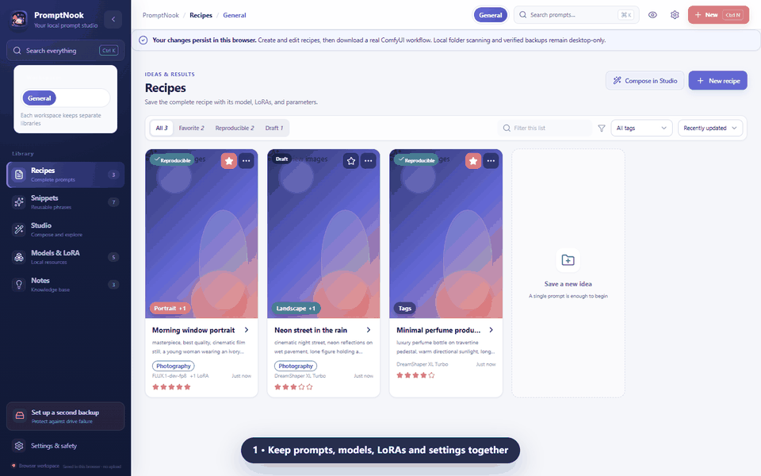
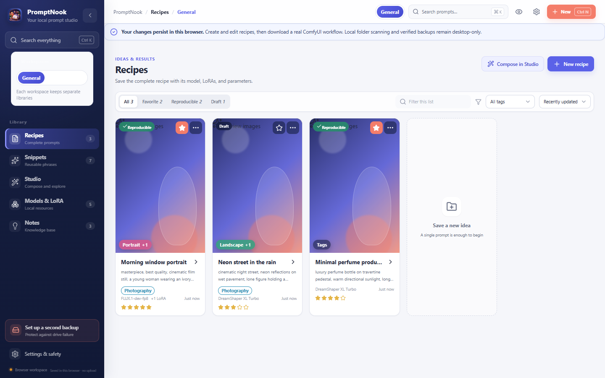
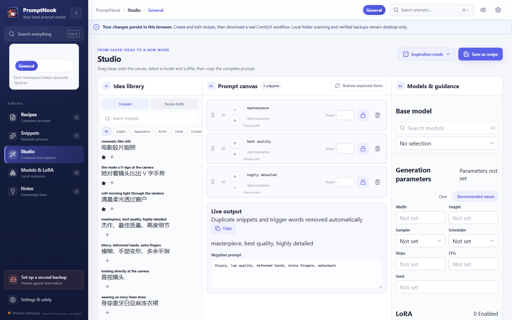
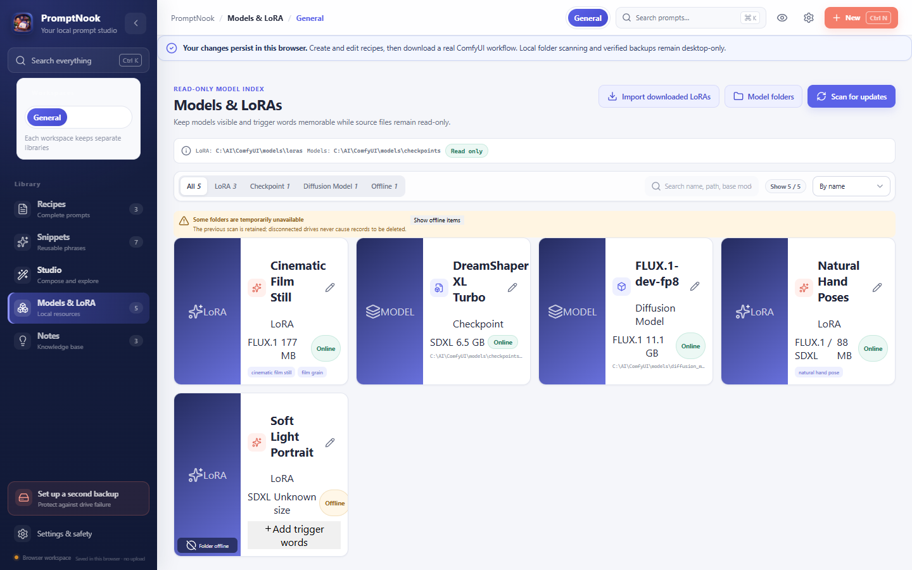

<div align="center">
  
  <h1>PromptNook</h1>
  <p><strong>From scattered prompts to editable ComfyUI workflows.</strong></p>
  <p>Organize prompt recipes, checkpoints, LoRAs, trigger words, and generation settings in one private, local-first workspace.</p>

  [](https://github.com/Rona1do/PromptNook/actions/workflows/ci.yml)
  [](LICENSE)
  [](https://tauri.app/)

  **[Open the browser workspace](https://rona1do.github.io/PromptNook/)** ·
  [Releases](https://github.com/Rona1do/PromptNook/releases) ·
  [ComfyUI export details](docs/COMFYUI_EXPORT.md)
</div>

> **Try the complete browser workflow now.** Changes are saved in your browser, never uploaded, and checkpoint-based recipes can be downloaded as real ComfyUI Workflow JSON 0.4 files. Folder scanning and verified backups remain desktop-only.



[简体中文](README.zh-CN.md)

## Try it in 60 seconds

1. Open the [browser workspace](https://rona1do.github.io/PromptNook/); no account or installation is required.
2. Open **Neon street in the rain** to inspect its checkpoint, prompt, and generation settings.
3. Choose **Export ComfyUI workflow** and load the downloaded JSON in ComfyUI.

Your edits persist in that browser through local storage. The desktop build adds local checkpoint/LoRA folder scanning, SQLite storage, portable backups, and operating-system credential protection.

## Why PromptNook?

Successful generations are more than prompt text. They also depend on the checkpoint, ordered LoRAs, trigger words, sampler, scheduler, seed, dimensions, and the small notes that explain why a recipe works. PromptNook keeps those pieces searchable and connected, then turns a saved checkpoint recipe into an editable ComfyUI graph.

Unlike a cloud prompt gallery, PromptNook requires no PromptNook account and does not upload your library. Unlike a plain text file, it preserves the resources and settings needed to reproduce a result.

## Highlights

- **Working browser workspace** — create and edit recipes and snippets with browser-local persistence, then download checkpoint-based ComfyUI workflows without installing PromptNook.
- **ComfyUI workflow export** — produce an editable Workflow JSON 0.4 graph with checkpoint, ordered LoRAs, prompts, size, sampler, scheduler, steps, CFG, and seed already connected.
- **Local model catalog** — the desktop app scans configured checkpoint, diffusion-model, and LoRA folders instead of asking you to rebuild a catalog manually.
- **Custom workspaces** — create any model, client, or workflow name. Libraries are not hard-coded to three model families.
- **Recipes and snippets** — organize complete prompts, reusable fragments, negative prompts, notes, favorites, categories, and revision history.
- **Prompt Studio** — assemble prompts from reusable fragments and preserve the parameters behind a generation.
- **Language-flexible content** — use any translation target supported by your configured local or OpenAI-compatible provider. Translation is off by default.
- **Verified desktop backups** — content-addressed media, integrity checks, recovery mode, trash, JSON/CSV export, and portable `.promptnook` packages.

## Screenshots

<details>
  <summary>Prompt library, Studio, and local model catalog</summary>

  

  

  
</details>

The screenshots use repository sample data. They do not contain a maintainer's private library or filesystem paths.

## Project language policy

English is the repository and interface language so contributors can collaborate globally. Simplified Chinese documentation remains available because it is useful, not because prompt content is tied to Chinese. Prompt content and translation targets are language-agnostic: users can enter any target supported by their configured translation provider.

The original private prototype's primary Chinese-only interface has been migrated for v0.2. A resource-based Simplified Chinese UI locale and localized low-level diagnostics remain on the roadmap; the project will not claim generic “all-language UI” support before each locale is complete and reviewable.

## ComfyUI export

Open an existing recipe in the browser workspace or Windows desktop app and choose **Export ComfyUI workflow**. PromptNook writes an editable ComfyUI Workflow JSON 0.4 file and reports any offline or unresolved model references. The current graph uses ComfyUI core nodes and supports checkpoint-based text-to-image recipes; FLUX/diffusion-model graphs are deliberately deferred to a dedicated template. See [the export design and compatibility notes](docs/COMFYUI_EXPORT.md).

## Platform status

The desktop app is currently developed and tested on **Windows 10/11**. The stack is cross-platform, but macOS and Linux packaging is not yet verified. Do not present those platforms as supported until their release workflows are tested.

Public Windows installers are withheld until a trusted code-signing workflow is available. Source releases remain available for review and local builds. See the [code signing policy](docs/CODE_SIGNING.md).

## Quick start

Prerequisites:

- Node.js 24.15 or newer
- Rust stable with Cargo
- Windows WebView2 (normally already present on Windows 10/11)
- Tauri 2 system prerequisites

```bash
git clone https://github.com/Rona1do/PromptNook.git
cd PromptNook
npm ci
npm run tauri:dev
```

To run the browser workspace locally:

```bash
npm run dev
```

## Quality checks

```bash
npm test
npm run build
cargo fmt --manifest-path src-tauri/Cargo.toml --all -- --check
cargo clippy --manifest-path src-tauri/Cargo.toml --all-targets -- -D warnings
cargo test --manifest-path src-tauri/Cargo.toml
```

## Privacy and translation

Translation is disabled by default. When enabled, only text selected for translation is sent to the configured endpoint. PromptNook supports local Ollama and OpenAI-compatible endpoints; credentials are stored with the operating-system credential manager rather than in SQLite. Read [docs/PRIVACY.md](docs/PRIVACY.md) before enabling a network provider.

## Data location

On Windows, PromptNook stores its desktop data under `%LOCALAPPDATA%\PromptNook\vault`. This is intentionally separate from older/private builds. Choose a second physical drive for backups when possible.

## Contributing

Start with [CONTRIBUTING.md](CONTRIBUTING.md), the [roadmap](ROADMAP.md), and issues labeled `good first issue`. By participating, you agree to follow the [Code of Conduct](CODE_OF_CONDUCT.md). Security issues should be reported privately using [SECURITY.md](SECURITY.md).

Questions, workflow ideas, and early feedback are welcome in [GitHub Discussions](https://github.com/Rona1do/PromptNook/discussions). Please use [Issues](https://github.com/Rona1do/PromptNook/issues) for reproducible bugs and scoped feature requests.

## License

PromptNook is released under the [MIT License](LICENSE).
