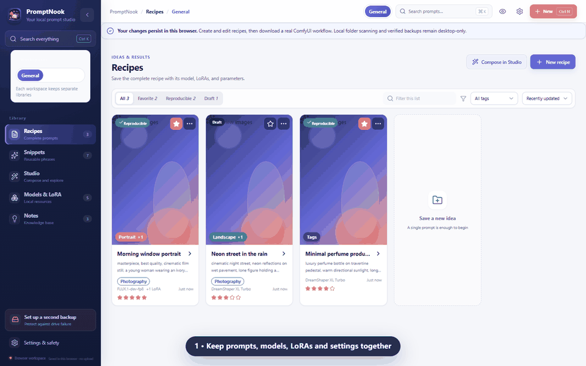
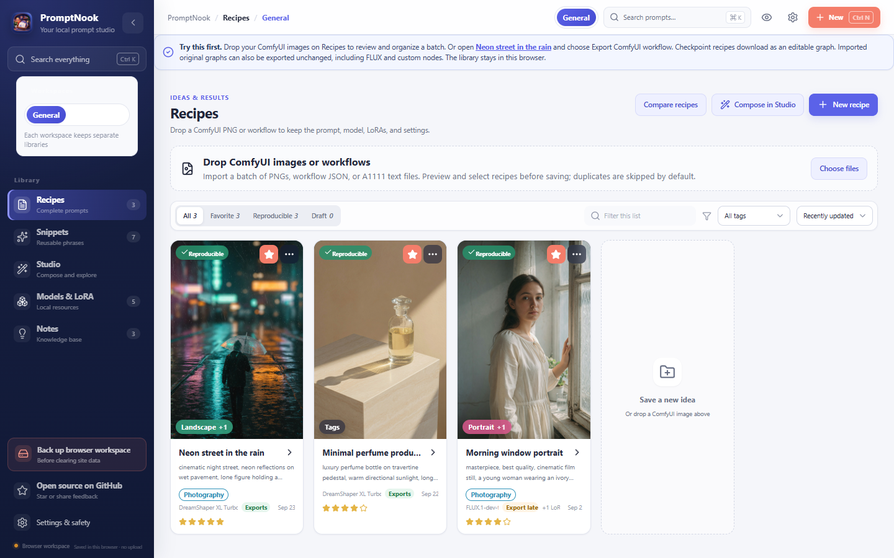
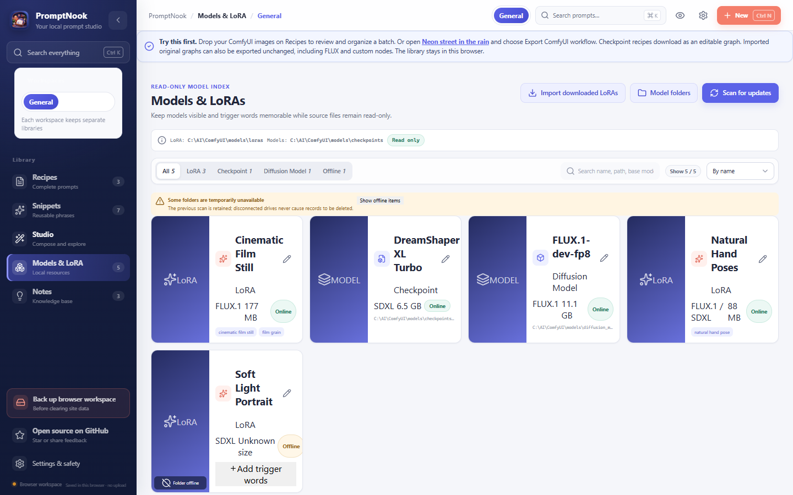
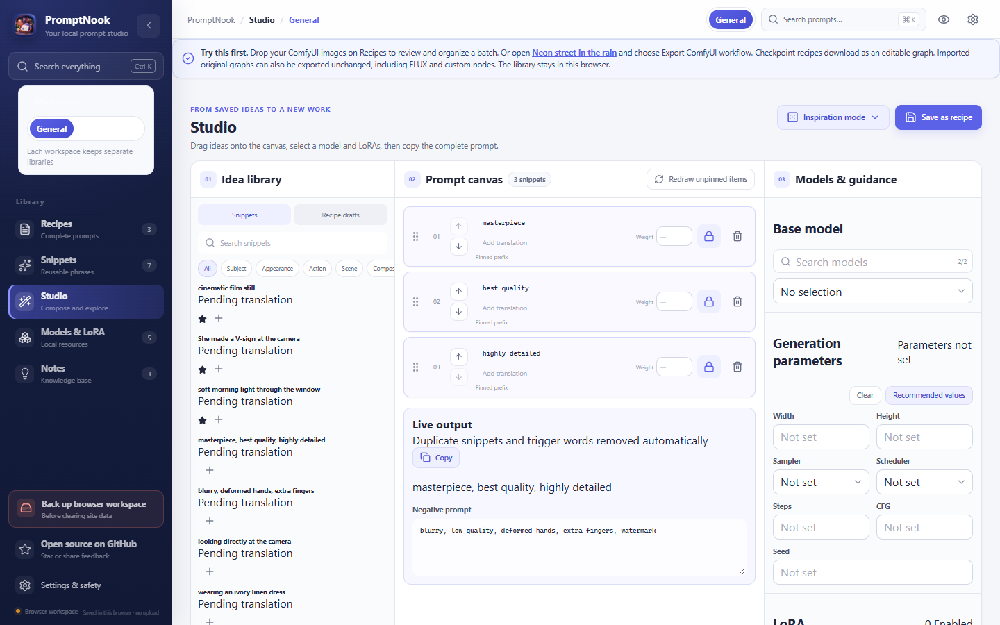
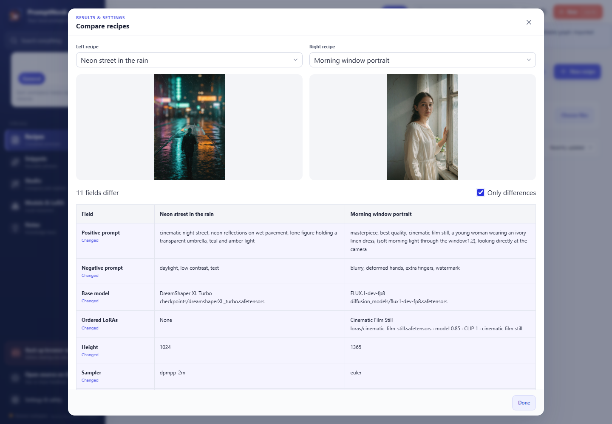

<div align="center">
  
  <h1>PromptNook</h1>
  <p><strong>为 ComfyUI 创作者设计的本地优先配方库。</strong></p>
  <p>批量整理已有出图，比较配方和结果，保留并导出原始 ComfyUI 图。</p>

  **[立即体验浏览器 Demo →](https://rona1do.github.io/PromptNook/)** ·
  **[下载 Windows 预览版](https://github.com/Rona1do/PromptNook/releases/tag/v0.3.0-beta.1)** ·
  [ComfyUI 导出说明](docs/COMFYUI_EXPORT.md)
</div>

[English](README.md)

把 ComfyUI 的 PNG 或 workflow JSON 拖进[浏览器工作区](https://rona1do.github.io/PromptNook/)。PromptNook 会把它收成一条配方：checkpoint 或 diffusion model、按顺序的 LoRA、Prompt 和采样参数，并把 checkpoint 文生图配方再导出成可编辑的 ComfyUI 图。不需要账号，资料留在这个浏览器里。



## 60 秒上手

1. 打开[浏览器工作区](https://rona1do.github.io/PromptNook/)。
2. 把一张或一批 ComfyUI PNG、workflow JSON 拖到 **Recipes**。预览 Prompt、模型、LoRA 和采样设置，勾选后点击 **Import selected** 入库，PNG 会成为封面；重复配方默认不勾选。
3. 打开导入的配方，点击 **Export original graph** 取回原始工作流。checkpoint 配方或示例 **Neon street in the rain** 可通过 **Export ComfyUI workflow** 按已保存字段重新生成节点图。点击 **Compare recipes** 比较出图和参数差异。

导入的 FLUX 和自定义节点图可通过 **Export original graph** 按原样导出；配方编辑不会覆盖原图，按编辑后的 FLUX 配方重新生成图仍需专用模板。Windows 桌面版仍为未签名 beta，额外提供目录扫描、SQLite 和可校验备份，安装时可能出现 SmartScreen 警告。桌面数据库升级到 schema 6，升级前请备份。

## 选择体验方式

| | 浏览器工作区 | Windows 桌面版 |
| --- | --- | --- |
| 适合 | 体验从配方到工作流的完整流程 | 管理真实的本地模型资料库 |
| 开始方式 | 无需安装或注册 | 下载明确标注为 unsigned 的预览版 |
| 功能 | 持久化配方、片段、Studio、JSON 备份、ComfyUI 导出 | 浏览器版全部功能，以及目录扫描、SQLite、凭据保护和可迁移校验备份 |
| 数据位置 | 保存在当前浏览器 | 保存在你的电脑 |

浏览器版不是静态样品。你可以导入自己的出图、编辑 starter recipes、下载真实的 ComfyUI Workflow JSON 0.4，关闭页面后再回来继续。清理站点数据前，请在 **Settings → Backup & export** 下载版本化备份。

## 项目定位

成功生成一张图所依赖的不只是 Prompt 文本，还包括 checkpoint、按顺序加载的 LoRA、触发词、采样器、调度器、种子、尺寸，以及解释“为什么这样有效”的备注。PromptNook 把这些信息连接起来，并能将保存的 checkpoint 配方导出为可编辑的 ComfyUI 节点图。

PromptNook 不要求注册云端账号，也不会上传你的资料库；相比普通文本文件，它能保留复现结果所需的资源与参数。

## 主要功能

- **保留原始工作流**：JSON 和 PNG 导入保留 ComfyUI 原图，包括 FLUX、自定义节点、连接、布局及大整数种子。可单独导出原图，模型与自定义节点仍需在 ComfyUI 中安装。
- **配方和出图对比**：并排查看两个结果，突出 Prompt、LoRA 与采样参数差异，并可仅显示变化字段；隐私模式隐藏 Prompt、备注和图片。
- **批量导入预览与去重**：一次选择多张出图和工作流，入库前查看封面、Prompt、模型与参数。当前工作区或本批次中生成信息完全一致的配方默认跳过；不同种子会分别保留。错误逐项显示，保存失败可重试，已成功的条目不会再次保存。
- **导入已经出好的图**：拖入 ComfyUI PNG、workflow JSON 或 A1111 参数文本。checkpoint 或 diffusion model、按顺序的 LoRA、正负 Prompt、尺寸、采样器、步数、CFG 和种子会收成一条配方，PNG 成为封面。
- **可实际使用的浏览器工作区**：创建和编辑配方、片段与工作区，刷新后数据仍在，并可直接下载 checkpoint 类型的 ComfyUI 工作流。
- **浏览器备份与恢复**：导出版本化 JSON，经校验后恢复，或重置到当前英文 starter workspace；翻译凭据绝不会进入导出文件。
- **ComfyUI Workflow JSON 0.4 导出**：自动连接 checkpoint、按顺序加载的 LoRA、正负 Prompt、尺寸、采样器、调度器、步数、CFG 和种子。
- **本地模型目录**：桌面版直接扫描现有 checkpoint、diffusion model 和 LoRA 文件夹，不要求重新手工建库。
- **自定义工作区**：可填写任意模型、客户或工作流名称，不固定为三种预设模型。
- **配方与片段**：管理完整 Prompt、可复用短语、负面词、标签、收藏、备注和修订历史。
- **Prompt Studio**：组合片段，并保留生成参数。
- **语言灵活**：翻译目标由用户配置，支持本地或 OpenAI-compatible 服务，默认关闭翻译。
- **桌面端可靠备份**：支持内容寻址媒体、完整性校验、恢复模式、回收站、JSON/CSV 和 `.promptnook` 迁移包。
- 默认数据不包含成人向预设，也不对某一种内容类型作特殊假设。

## 界面截图

<p align="center">
  
  
</p>





截图使用仓库自带的示例数据，不包含维护者的私人资料库或个人文件路径。

## ComfyUI 导出

通过 **Export original graph** 按原样导出导入的 UI 工作流或 API prompt，包括 FLUX 和自定义节点。通过 **Export ComfyUI workflow** 根据已保存的 checkpoint 文生图配方重新生成可编辑节点图，并提示缺失的资源引用。按编辑后的 FLUX 配方重新生成图仍需专用模板。兼容性和字段映射见 [docs/COMFYUI_EXPORT.md](docs/COMFYUI_EXPORT.md)。

## 当前平台

目前仅在 **Windows 10/11** 上开发和验证。代码结构具备跨平台基础，但在 macOS 和 Linux 的打包流程验证完成前，不会宣称正式支持。

当前 Windows prerelease 已提供在文件名和 release notes 中明确标为 **UNSIGNED** 的安装包，可能触发 Windows 信誉或发布者警告。正式签名的稳定发行仍需先建立获批的可信代码签名流程。源码版本仍可供审阅和自行构建，详见[代码签名策略](docs/CODE_SIGNING.md)。

首个 Windows 正式版需要先通过干净机器安装/卸载、旧版本升级和跨机器备份恢复检查。在这些结果被记录前，单纯把 beta 标签改成 stable 只是更换营销名称，并不能提高发行质量。

## 本地开发

请先安装 Node.js 24.15+、Rust stable、Cargo、Windows WebView2 和 Tauri 2 所需的系统依赖。

```bash
git clone https://github.com/Rona1do/PromptNook.git
cd PromptNook
npm ci
npm run tauri:dev
```

只运行浏览器工作区：

```bash
npm run dev
```

质量检查：

```bash
npm test
npm run build
cargo fmt --manifest-path src-tauri/Cargo.toml --all -- --check
cargo clippy --manifest-path src-tauri/Cargo.toml --all-targets -- -D warnings
cargo test --manifest-path src-tauri/Cargo.toml
```

## 隐私

翻译默认关闭。启用后，只有你主动要求翻译的文字会发送到所配置的服务。API 密钥保存在操作系统凭据管理器中，不写入 SQLite。详细说明见 [docs/PRIVACY.md](docs/PRIVACY.md)。Windows 桌面数据目录为 `%LOCALAPPDATA%\PromptNook\vault`，不会自动读取原私人项目的数据。

## 语言策略

当前界面和 starter workspace 为英文，Prompt 内容可以使用任意语言。完整的简体中文 UI 和底层诊断信息本地化仍在路线图中；**Prompt translation** 只翻译 Prompt 内容，不会切换界面语言。具体见 [ROADMAP.md](ROADMAP.md)。

## 参与贡献

请阅读 [CONTRIBUTING.md](CONTRIBUTING.md)、[ROADMAP.md](ROADMAP.md)、[CODE_OF_CONDUCT.md](CODE_OF_CONDUCT.md) 和 [SECURITY.md](SECURITY.md)。

使用场景、工作流想法和早期反馈欢迎发布到 [GitHub Discussions](https://github.com/Rona1do/PromptNook/discussions)；可复现的问题和范围明确的功能建议请提交到 [Issues](https://github.com/Rona1do/PromptNook/issues)。

如果 PromptNook 解决了你的实际工作流问题，欢迎点一个 GitHub Star，帮助其他 ComfyUI 用户发现它。

## 许可证

本项目采用 [MIT License](LICENSE)。
